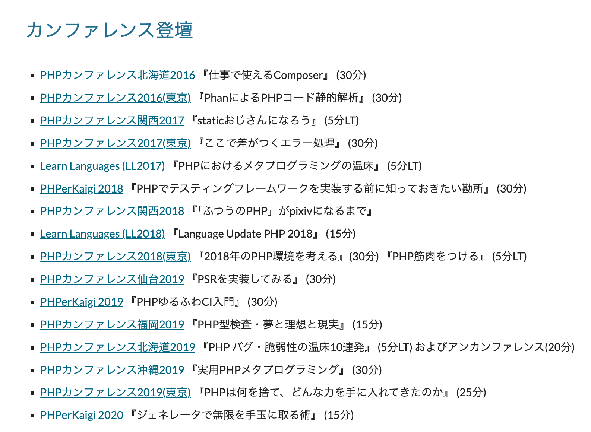

# 20I5年 福岡の旅

こんにちは！ Advent Calendarです！

[PHPカンファレンス福岡について語ってほしい！ Advent Calendar 2025 - Adventar](@:https://adventar.org/calendars/12467)

PHPカンファレンス福岡、10年完走おつかれさまでした！

ところで私は2015年の頃はまだ駆け出しでございまして、おいそれとイベントのために遠出するような行動力はなかったのでございます。

<blockquote class="twitter-tweet">
PHPカンファレンス福岡にかこつけて僕も福岡出張に行きたい
&mdash; にゃんだーすわん (@tadsan) <a href="https://twitter.com/tadsan/status/582568590940860416?ref_src=twsrc%5Etfw">March 30, 2015</a></blockquote>

*—— 10年後、飽きるほど飛び回る羽目になるとは夢にも思わず呑気なことを…*

自分と福岡の関係はなかなか複雑なものだったと自分では考えておりまして。

私は2016年頃からあちこちのカンファレンスで話させていただいているのですが、福岡に採択していただけるようになったのは結構後の方だったのでした。

私は不遜にも「採択されないなら自分で話す場を作ればいいじゃん」などと考えておりますので、初めて非公式イベントなんてものを勝手に主催したのも福岡なのでした。

[【非公式】PHPカンファレンス福岡2018前夜祭リジェクトコン #phpconfuk_rej - connpass](@:https://connpass.com/event/83136/)

初めてPHPカンファレンス福岡にお邪魔したのは2017年からでして、元々はFusicさんでAfter Hack!!と称して帰りの飛行機や新幹線までの時間に集まって交流するような催しがありましたし、2018年当時はあちこちで「リジェクトコン」と称して採択されなかったトークを集めた会をやるのも流行っていたので、それ自体は特にオリジナリティがある行動だったとは言えないのですが、この文化は福岡以外の場所でも[PHP Lovers Meetup](https://php-lovers-meetup.connpass.com/)のような形で今まで続いているのかなと思います。

[PHP Lovers Meetup - connpass](@:https://php-lovers-meetup.connpass.com/)

さて、それはそれとして私は初期PHPカンファレンス福岡のキャラクターが大好きなのでございます。

みなさまはこのサイトを見て、何か違和感はありませんでしたでしょうか…？ ところでこの記事のタイトルは…？

-----

そういったことはさておき、PHPカンファレンス福岡はPHP界隈のカンファレンス文化の一つの特異点だったと思うのです。もちろんそれは福岡に限った話ではなく、自分にとってもイベントに集まる人々が相互に影響しあって輪が広がっていく様子を目のあたりにできた10年だったな、という感想があります。

PHPカンファレンス福岡は今回終わってしまいましたが、その命脈は断たれてしまったのでしょうか。

<blockquote class="twitter-tweet">
カンファレンスをやりたいと願う心があれば、またどこかで受け継がれるものがあるさ、くらいに考えてる
&mdash; にゃんだーすわん (@tadsan) <a href="https://twitter.com/tadsan/status/1991518769152422343?ref_src=twsrc%5Etfw">November 20, 2025</a></blockquote>
